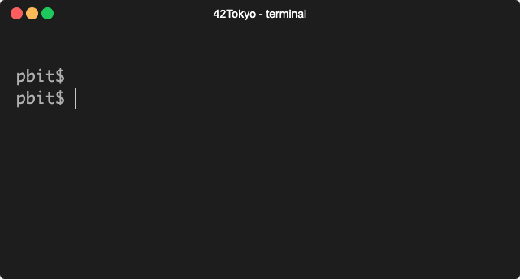

# pbit


## About The Project
Command line tools to print binary digits from decimal number.

## Installation
### Mac
```sh
$ brew tap tkomatsu/pbit && brew install pbit
```

### Other Unix or Linux
```sh
$ git clone https://github.com/tkomtsu/pbit
$ cd pbit
$ make install
```

## Usage
```sh
$ pbit 192
1100 0000

$ pbit 2147483
0000 0000 | 0010 0000 | 1100 0100 | 1001 1011

$ pbit 21474836321
0000 0000 | 0000 0000 | 0000 0000 | 0000 0100 | 1111 1111 | 1111 1111 | 1111 1111 | 0110 0001

$ getconf INT_MAX | pbit
0111 1111 | 1111 1111 | 1111 1111 | 1111 1111

$ pbit `getconf INT_MAX`
0111 1111 | 1111 1111 | 1111 1111 | 1111 1111

$ pbit 192 168 1 19
1100 0000
1010 1000
0000 0001
0001 0011
```

## License
Distributed under the MIT License. See [LICENSE](LICENSE) for more information.
